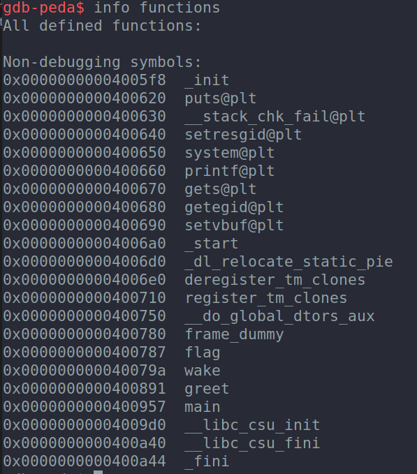
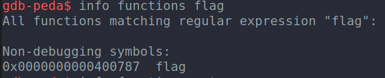

# Easy Buffer Overflow 
_Just some tips to remeber how to resolve easy buffer overflows_

## Tips 📝
**1.  Check the typical "win" or "flag" function on the binary with gdb (it's recommended to have [PEDA](https://github.com/longld/peda) installed to see registers and the program instructions in a prettier way).**

To open the binary with gdb:
```
gdb binary
```
To see the differents functions on the binary: 
```
gdb-peda$ info functions
```



**2. Get "flag" function memory address**: 
```
gdb-peda$ info functions flag 
```
imagen de la direccion de memoria de flag
```
gdb-peda$ info functions flag 
```


**3. Modify "main" returns memory address**:

- First we should puts a breakpoint on the "vulnerable" method (for example gets or fgets)
```
gdb-peda$ disas main
```


```
gdb-peda$ b * 0x000000000040093b ("gets" memory address)
```


**4. asd**

