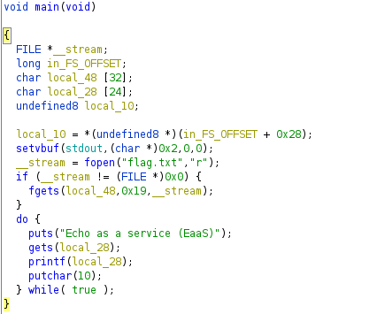

# Easy Simple format string to print a variable
_Just some tips to remeber how to resolve easy format strings.This challenge is from tamu2020 CTF_

## Steps 📝
**1.  Get the source code with [Ghidra](https://ghidra-sre.org/)**
In this callenge we don't have the source code so the first step is try to get it using some reversing tools as radare or ghidra.

In the code, the flag.txt file is read and stored on the "local_48" variable (the first 19 bytes) and then the program asks for an input (stored in local_28 which is defined after "local_48") and prints it (here is the format string vuln). 

As our input is defined after the variable where the flag is stored, we have to print it with the format string vuln writing some "%p " to print the previous stack positions and converting them to ASCII (check solution.py). 
