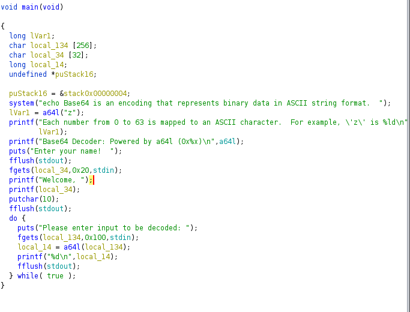

# NOT FINISHED

## Steps 📝
**1.  Get the source code with [Ghidra.](https://ghidra-sre.org/)**

In this challenge we don't have the source code so the first step is try to get it using some reversing tools as radare or ghidra.

As we can see in the code, the program prints the address of the a64l function from the libc. Then, it gets an entry (just 20 bytes) and prints it (printf vulnerability) and finally, there is a while loop where the program asks for an input and passes it to the a64l function as a paremeter. 

After understanding the code, our goal is to make the program calls the system function instead a64l an execute what we want (cat flag.txt or /bin/sh as we can pass anything to a64l as parameter in the loop)

**2. Getting functions addresses**

In this challenge apart from the binary, we are given the libc (it's the file libc.so.6).

