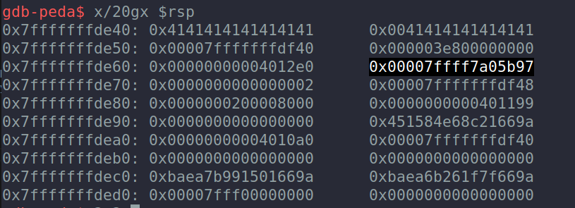

# Easy Simple Buffer Overflow 
_Just some tips to remeber how to resolve easy buffer overflows_

## Steps 📝
**1.  Check the typical "win" or "flag" function on the binary with gdb (it's recommended to have [PEDA](https://github.com/longld/peda) installed to see registers and the program instructions in a prettier way).**

To open the binary with gdb:
```
gdb$ binary
gdb$ info functions
```

**2.  Check main return address**
If you look at the main function instruccions you will see that the ret has the address 0x00000000004012dd, so lets put a breakpoint and print the stack to see the address which the ret is pointing at:
```
gdb$ disas main  
gdb$ b *0x00000000004012dd
gdb$ x/gx $rsp
```
It prints the following address: 0x00007ffff7a05b97. With that address we can see where we want to write the flag address in order to execture it instead exiting the program. 

**3.  Prepare the payload**

As you can see the flag function has the address 0x0000000000401186 and the return address of the main function points to 0x00007ffff7a05b97. Now, we have to see how many characters we need to write on the satck before reach the main ret address and overwrite it with the flag function one. 

First we should put a breakpoint on the gets function: 
```
gdb$ disas main  
```
Here you can see the gets address. To put the breakpoint: 
```
gdb$ b *0x00000000004012ba
gdb$ run 
```
The program stops brefore executing the gets. If we write "ni" (next instruction) on gdb it will execute the gets ans ask you for an input (just write some 'A' for testing) and print the stack to check how many you will need until reach the ret address of the main. 

```
gdb$ $x/20gx $rsp
```


If we look at the stack we can coun the number of chars we will need (40 in this case) and then the return address.