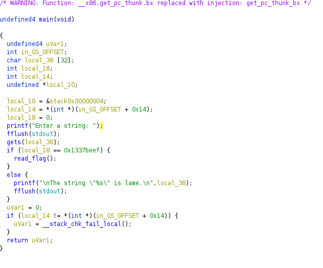

# Easy Simple Buffer Overflow to overwrite a variable
_Just some tips to remeber how to resolve easy buffer overflows. This challgen is from tamu2020 CFT_

## Steps 📝
**1.  Get the source code with [Ghidra](https://ghidra-sre.org/)**
In this callenge we don't have the source code so the first step is try to get it using some reversing tools as radare or ghidra.

As we can see in the code there is a gets function and we have to overwrite the variable "local_18" to bee "0x1337beef". If we looks closer at the definition of the local variables we can see that we have the variable "local_38" (which is where our input it's going to be) and then the target variable, so the unique thing we have to do it's to write the 32 chars that local_38 has and then our payload, in this case "0x1337beef".
